# THREAD-RAG


### Traversal-Heuristic Retrieval for Embedded And Distributed Retrieval-Augmented Generation

---

# Overview

THREAD-RAG is a retrieval architecture designed for long-document reasoning. Instead of treating documents as isolated chunks, it models documents as ordered semantic threads. This allows a system to jump to a relevant section using semantic search and then walk through the document sequentially to reconstruct context and reasoning paths.

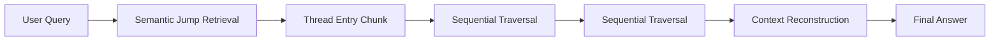

---

# Core Idea

Traditional RAG systems:

```
query → top-k chunks → answer
```

THREAD-RAG:

```
query → semantic jump → thread entry → sequential traversal → optional cross-thread comparison → answer
```

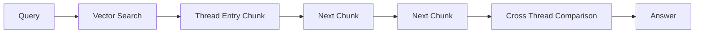

---

# Document Representation

Documents are converted into ordered chunk threads:

```
DOC1_000
DOC1_001
DOC1_002
DOC1_003
```

Each chunk contains:

* chunk_id
* chunk_content
* doc_id

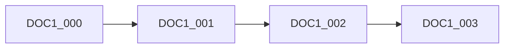

---

# Context Window Structure

Each chunk is presented using a contextual window:

```
PREVIOUS SUMMARY
ACTIVE CONTENT
NEXT SUMMARY
```

Example:

```
--- CONTEXT WINDOW: DOC1_009 ---

PREVIOUS SECTION SUMMARY
(summary of DOC1_008)

ACTIVE CONTENT
(actual text of DOC1_009)

FOLLOWING SECTION SUMMARY
(summary of DOC1_010)

--- END WINDOW ---
```

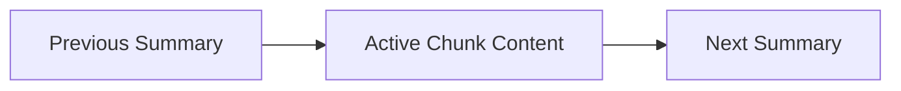

---

# Why Context Stitching Matters

Chunking fragments information across boundaries. THREAD-RAG reconstructs context by attaching summaries of neighboring sections so the model understands where the current chunk sits within the broader narrative.

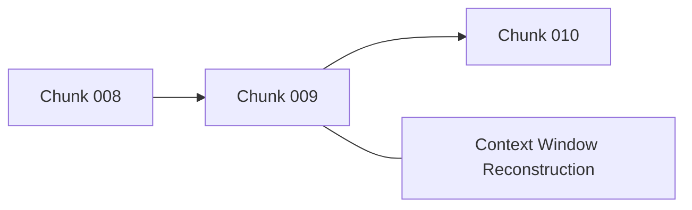

---

# Retrieval Architecture

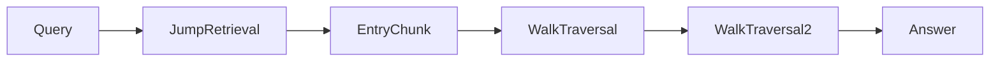

---

## 1. Jump Retrieval (Dart Mode)

```
query → vector search → starting chunk
```

This identifies an entry point in the document thread.

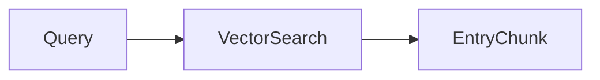

---

## 2. Sequential Traversal (Walk Mode)

```
chunk_i → chunk_(i+1) → chunk_(i+2)
```

The system reads forward or backward along the thread when summaries indicate the topic continues.

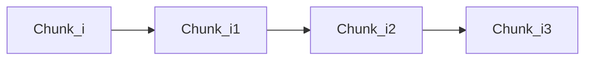

---

# Hybrid Retrieval Strategy

THREAD-RAG naturally supports patterns such as:

```
jump → walk → walk → jump
```

Example workflow:

```
rag_search(query)
fetch_chunks_by_id(DOC1_021)
fetch_chunks_by_id(DOC1_022)
rag_search(refined_query)
```

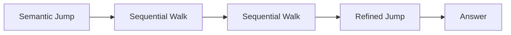

---

# Retrieval vs Navigation Separation

THREAD-RAG explicitly separates retrieval from navigation.

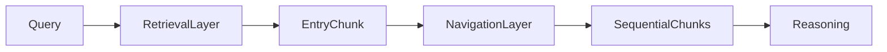

### Retrieval Layer

Purpose: locate relevant entry points
Method: vector search on chunk text

### Navigation Layer

Purpose: explore document structure
Method: sequential traversal across chunks

This separation avoids embedding duplication and top-k poisoning.

---

# Avoiding Top-K Poisoning

Embedding contextual summaries into every chunk can cause duplicate semantic signals. Adjacent chunks may share identical summary text, leading to clustering in retrieval results.

THREAD-RAG avoids this by embedding only the chunk text while using summaries purely for navigation and traversal.

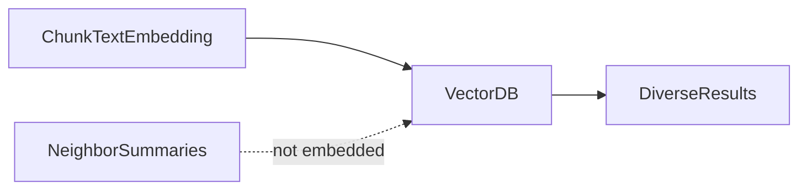

---

# Document Catalog System

THREAD-RAG includes a document catalog that allows the agent to discover indexed documents and restrict search scope.

Example:

```
DOC1: project guidelines
DOC2: grading policy
DOC3: thesis regulations
```

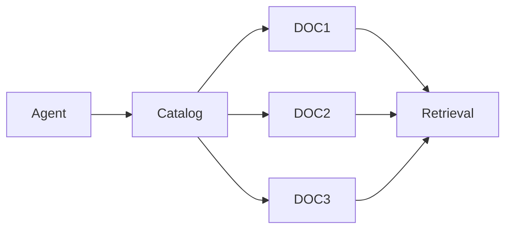

---

# Multi-Document Thread Traversal

The system supports reasoning across multiple documents simultaneously.

Example:

```
DOC1_020 → evaluation rules
DOC2_015 → grading policy
```

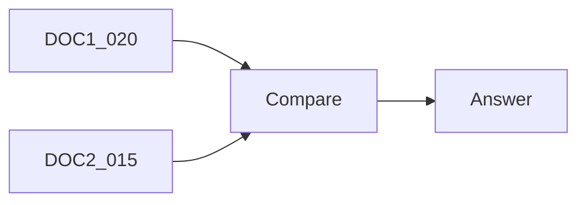

---

# Offline Summary Pre-Heating

THREAD-RAG pre-computes chunk summaries using a smaller model during ingestion. These summaries are cached and reused at runtime.

Benefits:

* faster responses
* lower token cost
* better traversal hints

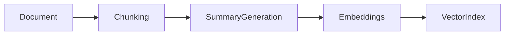

---

# Cost Optimization Strategy

### Ingestion Phase

```
document chunking
summary generation
embedding creation
vector indexing
```

### Query Phase

```
vector search
thread traversal
LLM reasoning
```

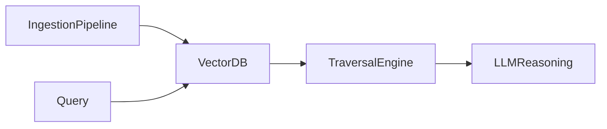

---

# Thread Traversal Signals

Traversal decisions are guided by:

* previous section summary
* next section summary
* semantic continuity

The agent decides whether to continue reading, stop traversal, or jump to another location.

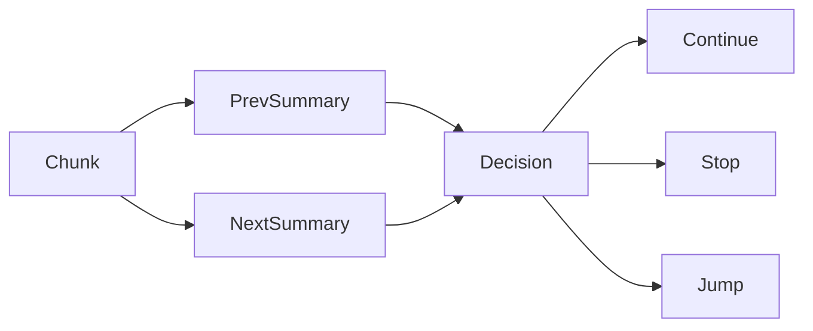

---

# Retrieval Diversity Preservation

Because embeddings contain only the chunk text, search results remain diverse across documents rather than clustering around neighboring chunks.

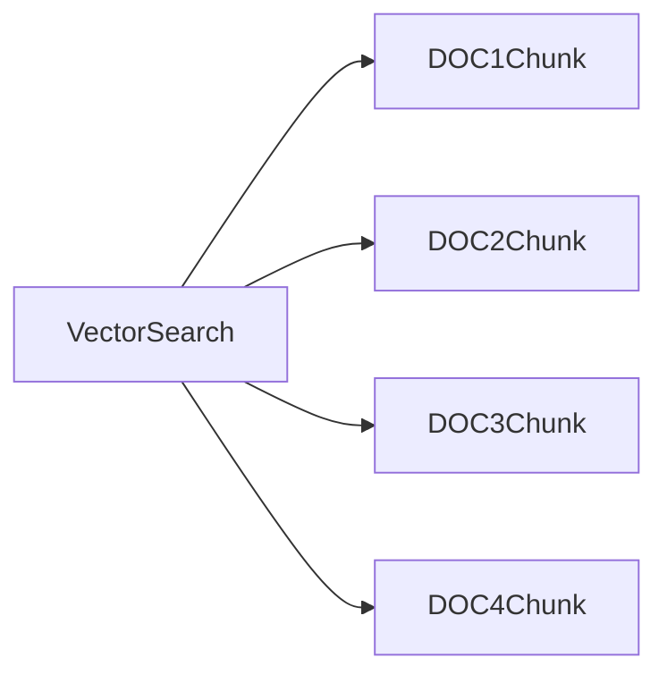

---

# System Capabilities

THREAD-RAG enables:

* sequential document reading
* policy comparison
* long-range dependency tracing
* narrative reasoning
* cross-document analysis

---

# Comparison With Other RAG Approaches

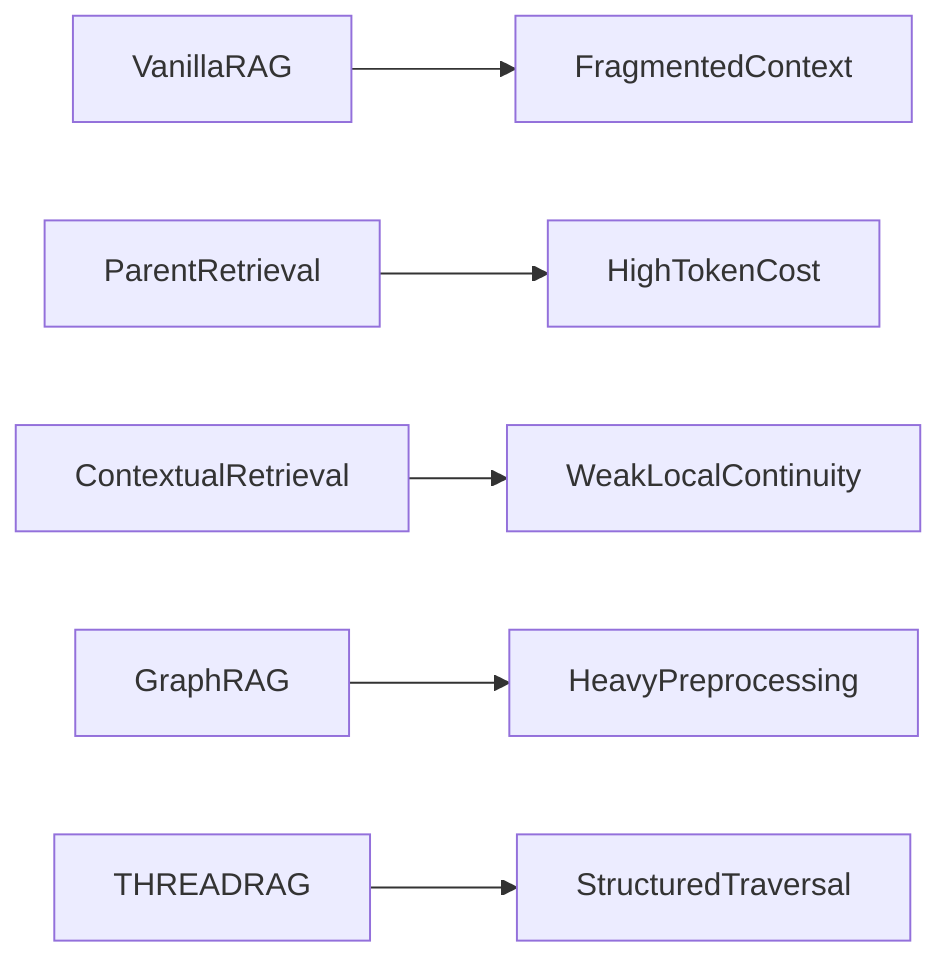

---

# Architectural Principles

THREAD-RAG follows several design principles:

* structured document representation
* retrieval diversity
* guided navigation
* offline preprocessing
* agent-driven reasoning

---

# Typical Agent Workflow

```
1. list_available_documents
2. rag_search(query)
3. fetch_chunks_by_id(start_chunk)
4. sequential traversal if needed
5. answer synthesis
```

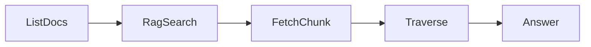

---

# Advantages

THREAD-RAG provides:

* improved contextual coherence
* efficient token usage
* stronger reasoning across long documents
* reduced runtime cost
* flexible retrieval patterns

---

# Ideal Use Cases

* technical manuals
* legal documents
* academic papers
* compliance policies
* procedural documentation
* version comparisons

---

# Conceptual Model

```
Document → Chunk Thread → Semantic Entry Point → Thread Traversal → Answer Generation
```

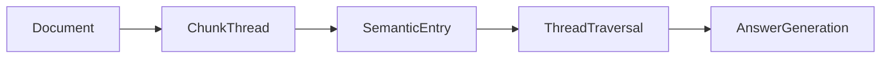

---

# Summary

THREAD-RAG is a thread-aware retrieval architecture that allows LLM agents to enter, traverse, and reason over structured documents. By combining semantic search with sequential traversal and contextual stitching, it preserves narrative continuity while maintaining efficient retrieval.

---

# Visual Comparison: THREAD-RAG vs Traditional RAG

## Traditional RAG Retrieval Flow

```mermaid
flowchart LR
Q[User Query] --> VS[Vector Search]
VS --> C1[Chunk A]
VS --> C2[Chunk B]
VS --> C3[Chunk C]
C1 --> LLM
C2 --> LLM
C3 --> LLM
LLM --> Answer
```

Problems:

* chunks are disconnected
* narrative continuity lost
* weak reasoning across sections

---

## THREAD-RAG Retrieval Flow

```mermaid
flowchart LR
Q[User Query] --> VS[Vector Search]
VS --> Entry[Thread Entry Chunk]
Entry --> Next1[Next Chunk]
Next1 --> Next2[Next Chunk]
Next2 --> Context
Context --> LLM
LLM --> Answer
```

Advantages:

* contextual continuity
* document traversal
* structured reasoning

---

# Full THREAD-RAG System Architecture

## Ingestion Pipeline (Offline)

```mermaid
flowchart LR
Docs[Raw Documents] --> Chunking
Chunking --> Summaries
Summaries --> Embeddings
Embeddings --> VectorDB[(Vector DB)]
Summaries --> SummaryCache[(Summary Cache)]
```

Outputs:

* vector embeddings
* chunk summaries
* ordered document threads

---

## Query & Traversal Pipeline (Runtime)

```mermaid
flowchart LR
UserQuery --> Agent
Agent --> Catalog[list_available_documents]
Catalog --> Search[rag_search]
Search --> VectorDB
VectorDB --> EntryChunk
EntryChunk --> Fetch[fetch_chunks_by_id]
Fetch --> Traverse1
Traverse1 --> Traverse2
Traverse2 --> Reasoning
Reasoning --> FinalAnswer
```

---

# THREAD-RAG Retrieval Pattern

```mermaid
flowchart LR
Jump1 --> Walk1
Walk1 --> Walk2
Walk2 --> Jump2
Jump2 --> Walk3
Walk3 --> Answer
```

Typical pattern:

```
jump → walk → walk → jump → walk
```
